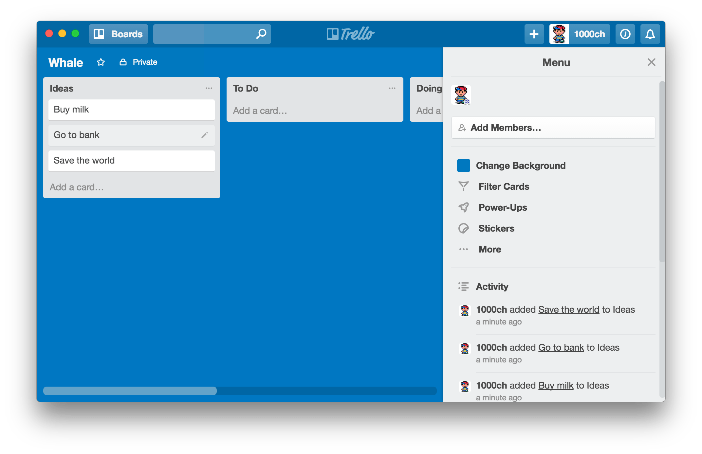

# Whale

Unofficial [Trello](https://trello.com/) app

[](https://travis-ci.org/1000ch/whale)
[](https://david-dm.org/1000ch/whale)
[](https://david-dm.org/1000ch/whale?type=dev)



## Install

macOS 10.9+ & Linux are supported.

### macOS

[Download](https://github.com/1000ch/whale/releases) and extract `.zip`, and move `Whale.app` to `/Applications`.

Alternatively, if you use [Homebrew](http://brew.sh/), you can install via:

```
brew cask install whale
```

### Windows

[Download](https://github.com/1000ch/whale/releases) and extract `.zip`, and move `Whale.exe` to some location.

### Linux

[Download](https://github.com/1000ch/whale/releases) and extract `.zip`, and move `Whale` to some location.

## Keyboard shortcuts

Description                | Keys
-------------------------- | --------------------------
Reset Zoom Level           | <kbd>Cmd/Ctrl</kbd> <kbd>0</kbd>
Make Text Smaller          | <kbd>Cmd/Ctrl</kbd> <kbd>-</kbd>
Make Text Larger           | <kbd>Cmd/Ctrl</kbd> <kbd>Shift</kbd> <kbd>=</kbd>

## License

[MIT](https://1000ch.mit-license.org) © [Shogo Sensui](https://github.com/1000ch)
