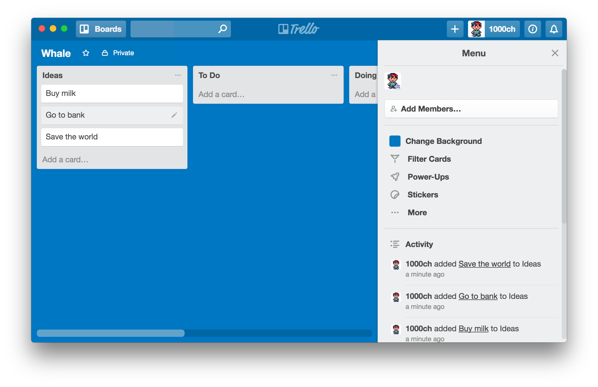

# Whale 

Unofficial [Trello](https://trello.com/) app 🐳



## Install

[macOS 12 (Monterey)](https://www.electronjs.org/docs/latest/tutorial/support#macos)+, [Windows](https://www.electronjs.org/docs/latest/tutorial/support#windows) and [Linux](https://www.electronjs.org/docs/latest/tutorial/support#linux) are supported.

### macOS

[Download](https://github.com/1000ch/whale/releases) and extract `.zip`, and move `Whale.app` to `/Applications`.

Alternatively, if you use [Homebrew](http://brew.sh/), you can install via:

```
brew install --cask whale
```

### Windows

[Download](https://github.com/1000ch/whale/releases) and extract `.zip`, and move `Whale.exe` to some location.

### Linux

[Download](https://github.com/1000ch/whale/releases) and extract `.zip`, and move `Whale` to some location.

## License

[MIT](https://1000ch.mit-license.org) © [Shogo Sensui](https://github.com/1000ch)
